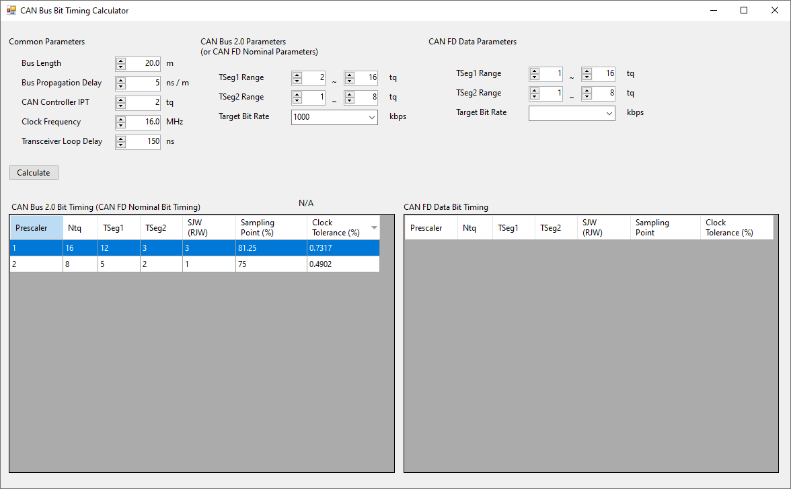

# CAN Bus Bit Timing Calculator

1. Simple Windows Form project
1. List all possible bit timing parameters
1. Sorting according to clock tolerance allows you to choose the best parameters
# Reference
1. [AN1798: CAN Bit Timing Requirements](https://www.nxp.com/docs/en/application-note/AN1798.pdf) by Stuart Robb, East Kilbride, Scotland, NXP
1. [Bit Time Requirements for CAN FD](https://www.bosch-semiconductors.com/media/ip_modules/pdf_2/papers/icc14_2013_paper_hartwich_1.pdf) by Florian Hartwich, Robert Bosch GmbH
1. [Robustness of a CAN FD Bus System – About Oscillator Tolerance and Edge Deviations](https://www.bosch-semiconductors.com/media/ip_modules/pdf_2/papers/icc14_2013_paper_mutter_1.pdf) by Dr. Arthur Mutter, Robert Bosch GmbH
# TODO
1. Add document
