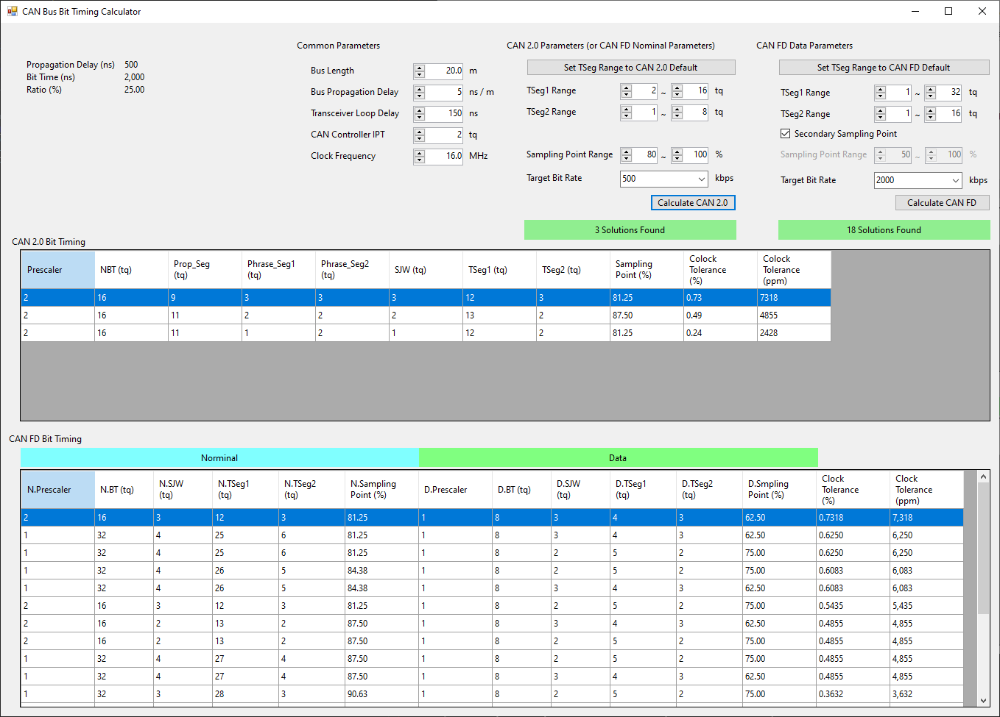

# CAN Bus Timing Calculator

1. Simple Windows Form project
1. List all possible parameter settings
2. Sort with clock tolerance
# TODO
1. Add CAN FD Bit timing calculator
2. Refactor
3. Add document
